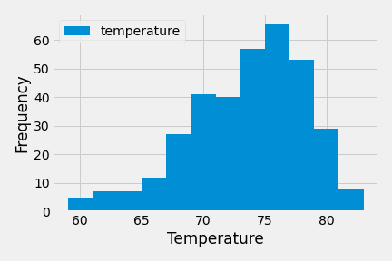

# sqlalchemy-challenge

## Climate Analysis and Exploration

In the climate notebook I performed climate analysis and data exploration of a climate database using Python and SQLAlchemy. All of the below analysis has been completed using SQLAlchemy ORM queries, Pandas, and Matplotlib.

### Read SQL database into Python

* Use SQLAlchemy create_engine to connect to your sqlite database and reflect the tables into classes.

* Link Python to the database by creating an SQLAlchemy session.

### Precipitation Analysis

* Retrieve the last 12 months of precipitation data by querying the 12 preceding months of data from the most recent date found in the dataset.

* Load the query results into a Pandas DataFrame and set the index to the date column.

* Sort the DataFrame values by date.

* Plot the results using the DataFrame plot method.

### Station Analysis

* Design a query to calculate the total number of stations in the dataset.

*Design a query to find the most active stations (i.e. which stations have the most rows?).

*List the stations and observation counts in descending order and find the station with the highest number of observations.

*Using the most active station id, calculate the lowest, highest, and average temperature.

* Design a query to retrieve the last 12 months of temperature observation data (TOBS) for the station with the higest number of observations.

* Plot the results as a histogram with bins=12.

